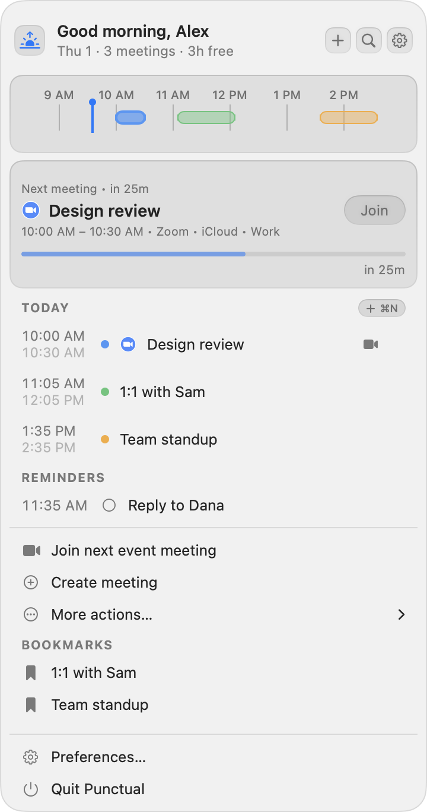

# Punctual

**Punctual** keeps your current or next meeting in the macOS menu bar and gets you into
it in one click. No AI, no account, no analytics. Free and open source.

Made by [Chykalophia](https://chykalophia.com) and maintained by
[Peter Krzyzek](https://peterkrzyzek.com).

**[Homepage](https://www.chykalophia.com/punctual)** ·
**[Download](https://github.com/Chykalophia/Punctual/releases/latest)** ·
[Privacy policy](https://www.chykalophia.com/punctual/policy) ·
[Terms of service](https://www.chykalophia.com/punctual/tos)

<picture>
  <source media="(prefers-color-scheme: dark)" srcset="docs/screenshots/dropdown-dark.png">
  
</picture>

<sub>Sample data, rendered from the app's real UI with `make screenshots`.</sub>

---

## Built on MeetingBar

Punctual is built on [**MeetingBar**](https://github.com/leits/MeetingBar), the open-source
menu-bar meeting app by [Andrii Leitsius](https://github.com/leits) and the MeetingBar
contributors. Their work is the foundation here: the calendar plumbing, the meeting-link
detection for 50+ services, and the reliability-first approach all started with them.

Punctual is a separate app with its own name, icon and roadmap. It is a derivative work
under the Apache License 2.0, it is not affiliated with or endorsed by the MeetingBar
project, and any bugs in Punctual are ours to fix. The full attribution lives in
[`NOTICE`](NOTICE).

Thank you, Andrii, and everyone who contributed to MeetingBar.

---

## Install

Punctual needs **macOS 15.0 or later** (Apple Silicon and Intel).

1. Download `Punctual-<version>.dmg` from the
   [latest release](https://github.com/Chykalophia/Punctual/releases/latest).
2. Open it and drag **Punctual** to Applications.
3. Launch it. Grant Calendar access when asked; Punctual cannot show meetings without it.

Releases are signed with a Developer ID certificate and notarized by Apple, so the app
opens without a Gatekeeper warning. To check a download yourself:

```bash
# should print: accepted ... source=Notarized Developer ID
spctl --assess --type open --context context:primary-signature -vv Punctual-<version>.dmg

# and match the .sha256 published beside the dmg
shasum -a 256 Punctual-<version>.dmg
```

**Updates:** from 1.1.0, Punctual updates itself. On its second launch it asks whether to
check for updates automatically; you can change that, or check by hand, under
Preferences ▸ About ▸ Updates, or from the right-click menu. Every update is signed by
Chykalophia and verified before it installs. Versions
before 1.1.0 have no updater, so moving to 1.1.0 is a one-time manual download.

---

## Features

### See what is next
* Your current or next meeting in the menu bar, with title, time, countdown, icon or
  meeting service.
* A composable menu bar: mix and match the icon, event title, countdown, date, clock, week
  number, world clock, and day or year progress, in the order you want.
* Meeting progress in the menu bar (underline, ring, capsule or mini bar). Off by default.
* A Join chip right on the menu bar for a meeting that has a link.
* Countdown styles (`2h`, `2h 30m`, `2:30`) and a lead time, so a meeting hours away does
  not take over the menu bar.
* Long titles shortened to keep the menu bar readable.

### The dropdown
* A greeting with today's meeting count and free time.
* A timeline of your day (Track, Bar or Minimal), a "Next meeting" card, and today's and
  tomorrow's agenda.
* Build your own layout: turn sections on or off and reorder them, with a live preview.
* A month calendar that folds to a single week, with dots on days that have meetings and
  markers for birthdays, anniversaries and deadlines.
* Light, dark or system appearance, and your choice of accent colour.
* Full keyboard navigation.

### Join meetings faster
* Join the current or next online meeting with one click, or with a global shortcut.
* Copy just the meeting ID (Zoom, Meet, Webex and others) when you need to dial in.
* Create an ad-hoc meeting in your preferred service.
* Open links in a preferred browser, or in the native app per service.
* Check your camera and mic before you join.

### Find and change things
* A command bar: search events by title, notes, location or attendee, and run quick
  actions from one shortcut.
* Create, edit and delete events without leaving the menu bar, including "this event" or
  "this and future events" for repeating ones.
* A month and week calendar window you can walk with the arrow keys, with a jump-to-date
  picker.
* A world clock panel for the time zones you work across.
* Right-click any meeting to join, copy, edit, delete or set its reminder.

### Reminders
* macOS notifications before a meeting starts or ends, with snooze.
* Full-screen reminders for the meetings you cannot miss.
* Per-meeting reminder times, so one standup can be quieter than the rest.
* Apple Reminders due today, right in the dropdown. Opt in; it asks for its own permission.

### Automate
* Bookmark recurring meetings.
* Launch at login.
* Shortcuts and AppleScript hooks, for example to pause music when you join a meeting.

### Calendars
* **macOS Calendar:** anything synced to Calendar.app (iCloud, Google, Exchange,
  Office 365, Yahoo, and others).
* **Google Calendar, directly:** with your own OAuth client, or with one shipped in the
  build. See [Google Calendar](#google-calendar-optional) below.
* Connect both at once. Meetings are merged into one list, and a meeting that shows up in
  both appears once.

### Meeting services
More than 50, including Google Meet, Zoom, Microsoft Teams, Webex, GoToMeeting, Skype,
Discord, Jitsi, RingCentral, BlueJeans, Whereby, Slack Huddle, FaceTime, LiveKit Meet,
Meetecho, and StreamYard.

---

## What is next

Punctual aims for close productivity parity with [Dot](https://www.trydot.app), with a
customizable, native look. Most of that list has shipped. Still open: a calendar picker
from the command bar, snoozing a reminder until you reach a location, and a performance
pass on both Apple Silicon and Intel.

**Not happening:** AI or LLM features of any kind, voice-to-text, and natural-language
event creation. Punctual will not parse free text into events.

The full checklist lives in [`ROADMAP.md`](ROADMAP.md).

---

## Privacy

Punctual has no account, no analytics and no server of its own. Calendar data goes from
your calendar provider to your Mac and is used only there: to show meetings, find meeting
links, and open the right one.

If you connect Google Calendar directly, Punctual asks for read-only access, and the data
goes straight between your Mac and Google, never through us. Disconnecting revokes it.

Location autocomplete in the event editor is opt-in. It sends the location text you type
to Apple (MapKit) for suggestions. It is off by default, and Preferences says exactly what
it sends.

Update checks, if you allow them, ask GitHub (where Punctual's releases live) whether a
newer version exists, at most once a day. Like any web request, that shows GitHub your IP
address and which Punctual version you have. No calendar data is involved, and Sparkle's
optional anonymous system-profile reporting is not used.

The full [privacy policy](https://www.chykalophia.com/punctual/policy) covers every detail.
Privacy questions: <privacy@chykalophia.com>.

---

## Build from source

Punctual needs **macOS 15.0 or later** and builds with Xcode, Swift 6, AppKit, SwiftUI,
and Xcode-managed Swift Package dependencies.

For local signing, create `XCConfig/DevTeamOverride.xcconfig` with your Apple development
team (this file is git-ignored):

```xcconfig
DEVELOPMENT_TEAM = <your development team id>
```

Common commands:

```bash
make build            # Debug build
make test             # SwiftPM logic tests + Xcode app-hosted tests with coverage
make test-logic       # Hostless SwiftPM logic tests only
make lint             # SwiftLint
make validate-strings # Verify English localization keys used by .loco()
```

Read [`docs/ARCHITECTURE.md`](docs/ARCHITECTURE.md) before changing app flow, calendar
providers, meeting-link detection, notifications, status-bar rendering, settings,
dependencies, entitlements, or release-sensitive configuration.

### Google Calendar (optional)

The **macOS Calendar** source works out of the box, including Google accounts added in
System Settings ▸ Internet Accounts. The **direct Google Calendar** source is still worth
adding: the EventKit mirror drops detail the Calendar API carries, notably conference
entry points and each attendee's response.

**You can use both.** Connect them at once and their meetings merge into one list. That
matters if some calendars only exist in Calendar.app (iCloud, Exchange) while your work
calendar is Google. A meeting arriving from both is shown **once**, using the Google copy
for the reason above. This is the existing cross-calendar deduplication (Preferences ▸
Filters ▸ "Hide duplicate events"), extended to know which source a meeting came from.
Turn it off to see both copies.

Calendar selection is stored per source, so turning one off and back on keeps its
choices. At least one source is always connected; the last one cannot be switched off.

Google needs an OAuth client, from one of two places.

**Bring your own:** Preferences ▸ Calendars ▸ "Use my own Google credentials". Create an
OAuth client of type **Desktop app** in the
[Google Cloud Console](https://console.cloud.google.com/apis/credentials), enable the
Google Calendar API, add yourself under "Test users", and paste the client ID. Calls then
run on your own project's quota under your own consent screen. This works in a build that
carries no credentials at all.

**Ship one with the build:** copy `XCConfig/GoogleSecrets.xcconfig.example` to
`XCConfig/GoogleSecrets.xcconfig` (git-ignored) and follow the steps in it. Google Calendar
then works out of the box for whoever runs the build.

A shipped client ID can be extracted from the binary. That is true of every native OAuth
app, not a flaw here. Google's own docs say the installed-app client secret "is obviously
not treated as a secret", and [RFC 7636](https://datatracker.ietf.org/doc/html/rfc7636)
says "secrets provisioned in client binary applications cannot be considered
confidential." What protects the flow is PKCE, which runs on every sign-in. An extracted
client costs you API quota and lets someone put your app's name on a consent screen. It
gives nobody access to anyone's calendar unless that person signs in themselves.

The OAuth redirect lands on a loopback listener (`http://127.0.0.1:<random port>`). That
is why the client must be the **Desktop app** type, and why the app carries the
`com.apple.security.network.server` entitlement. Google recommends loopback for macOS
desktop apps and is retiring the custom URL schemes it replaces, which any other app on
the Mac could register.

---

## Contributing

Contributions are welcome: focused fixes, meeting-service integrations, reliability
improvements, translations, and documentation. See [`CONTRIBUTING.md`](CONTRIBUTING.md).

---

## Credits

Punctual is a derivative work of [**MeetingBar**](https://github.com/leits/MeetingBar),
© 2020 [Andrii Leitsius](https://github.com/leits) and the MeetingBar contributors, used
under the Apache License 2.0. Andrii is Ukrainian; if MeetingBar has been useful to you,
consider [standing with Ukraine](https://stand-with-ukraine.pp.ua).

Punctual relies on:

* [KeyboardShortcuts](https://github.com/sindresorhus/KeyboardShortcuts) for global shortcuts
* [Defaults](https://github.com/sindresorhus/Defaults) for user settings
* [LaunchAtLogin](https://github.com/sindresorhus/LaunchAtLogin) for launch at login
* [AppAuth-iOS](https://github.com/openid/AppAuth-iOS) for Google Calendar OAuth

Punctual's icon is by Chykalophia; its source is in [`docs/brand`](docs/brand).

See [`NOTICE`](NOTICE) for the full attribution notice.

---

## License

Punctual is licensed under the [Apache License 2.0](LICENSE), the same license as
MeetingBar.
